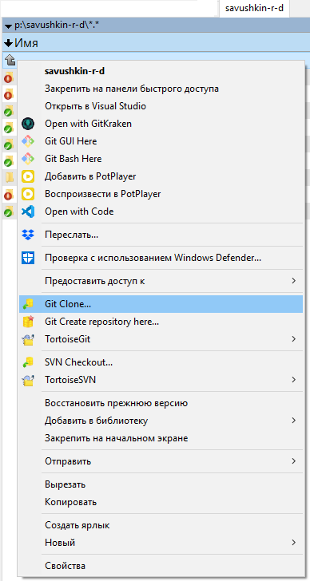
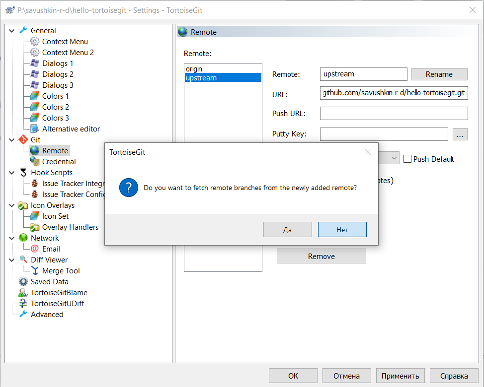
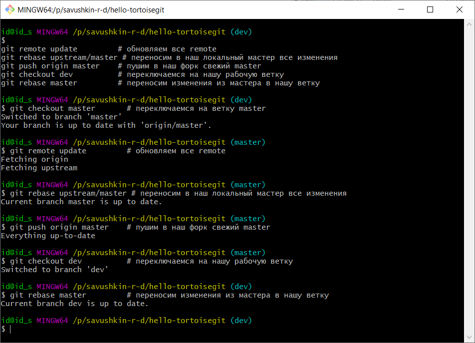

# Разработка с использованием сервиса [GitHub](https://www.Github.com/) #

# Содержание
1. [Установка **git**](#1-Установка-git)
2. [Установка git-клиента **TortoiseGit**](#2-Установка-git-клиента-TortoiseGit)
3. [Принципы работы с репозиторием](#3-Принципы-работы-с-репозиторием)
4. [Типовая схема совместной разработки проекта](#4-Типовая-схема-совместной-разработки-проекта)
5. [Создание и оформление **commit**-ов](#5-Создание-и-оформление-commit-ов)
6. [Запросы на внесение изменений (**Pull requests**)](#6-Запросы-на-внесение-изменений-Pull-requests)
7. [Именование документов](#7-Именование-документов)
8. [Использование **Мarkdown**](#8-Использование-Мarkdown)

## 1. Установка **git** ##

Скачать и установить с официального сайта [Git](https://git-scm.com/downloads/).

Git (произносится «гит») — распределённая система управления версиями. Проект был создан Линусом Торвальдсом для управления разработкой ядра Linux, первая версия выпущена 7 апреля 2005 года.

## 2. Установка git-клиента **TortoiseGit** ##

Скачать и установить с официального сайта [TortoiseGit](https://tortoisegit.org/download/).

TortoiseGit — визуальный клиент системы управления исходными кодами программ Git для ОС Microsoft Windows. Реализован как расширение проводника Windows (shell extension). Подрисовывает иконки к файлам, находящимся под управлением Git, для отображения их статуса в Git.

Пользовательский интерфейс сделан на основе TortoiseSVN, поэтому практически полностью совпадает с ним, за исключением возможностей, специфичных для Git.

## 3. Принципы работы с репозиторием ##

Прежде чем начать работу с репозиторием, необходимо сделать его собственное ответвление (fork - произносится «форк»). Для этого необходимо нажать кнопку `Fork` в правом верхнем углу экрана:


Если появилось окно с выбором организации, то следует выбрать свой профиль.

После этого клонируем собственное ответвление (fork) репозитория:


Для этого используем контекстное меню (длительное нажатие правой клавишей мыши) для требуемого каталога (рекомендуется использовать путь `"p:\savushkin-r-d\"`), далее выбираем пункт `"Git Clone"`:



Задаем параметры клонирования:

```sh
URL:        https://github.com/savushkin-r-d/hello-tortoisegit.git
Directory:  P:/savushkin-r-d/hello-tortoisegit/
```

в диалоговом окне:


Далее нажимаем кнопку `OK` и наблюдаем за ходом операции:


После успешного завершения соответствующий каталог будет содержать репозиторий git.

Чтобы удобно было работать, сразу стоит сделать себе ветку `dev` для работы (также используя контекстное меню):


Задаем название ветви, комментарий и указываем, что хотим далее работать с ней (активная галочка `"Switch to new branch"`):


Теперь можно работать с версией в своей ветке `dev`. **Настоятельно рекомендуется использовать ветку для разработки, а не `master`**.

Добавим наш основной репозиторий, чтобы с него можно было обновляться (более [подробно](https://git-scm.com/book/ru/v1/Основы-Git-Работа-с-удалёнными-репозиториями) про команды):


Нажимаем OK для окна с описанием подхода для хранения настроек:


Далее добавляем основной репозиторий. Задаем имя и путь для **основного** репозитория:

```sh
Remote: upstream
URL:    https://github.com/savushkin-r-d/hello-tortoisegit.git
```

для соответствующих полей и нажимаем кнопку `Add New/Save`:


и соглашаемся отключить обновление данного репозитория (нажимаем кнопку `"Да"`). Также отменяем получение ветвей добавленного репозитория:



(нажимаем кнопку `"Нет"`).

**Важно:** используйте следующие имена для `remote` ссылок:
- `upstream` - основной репозиторий (центральный), на нем всегда стабильная версия в `master`;
- `origin` - ваш `fork` основного репозитория.

Разделение на `upstream` и `origin` позволяет вам не бояться "сломать" что-либо в основном репозитории. Так как вся ваша работа будет происходить с `fork`-ом.

## 4. Типовая схема совместной разработки проекта ##

Типовая схема совместной работы состоит из следующих этапов:

1. Обновление текущей версии до актуального состояния
2. Внесение изменений
3. Фиксация изменений (*commit*) в своем репозитории
4. Создание запроса на внесение изменений (*Pull request*) в основной репозиторий
5. Доработка по итогам рецензирования
6. Удаление ветви после принятия запроса (завершение разработки)

### 1. Обновление текущей версии до актуального состояния ###

Далее будет ряд команд, которые позволят получать обновления и работать с основным репозиторием. Для их выполнения необходимо через контекстное меню для каталога репозитория вызвать консоль git:


Отобразится окно консоли для текущего репозитория:


```sh
  
git checkout master        # переключаемся на ветку master
git remote update          # обновляем все remote
git rebase upstream/master # переносим в наш локальный мастер все изменения
git push origin master     # пушим в наш форк свежий master
git checkout dev           # переключаемся на нашу рабочую ветку
  
```
Результат выполнения данных команд:



Для переноса изменений мы используем `rebase` - это позволяет сделать историю изменений легкой для чтения (более подробно можно почитать [тут](https://git-scm.com/book/ru/v1/Ветвление-в-Git-Перемещение) или [тут](https://habrahabr.ru/post/161009/)). Если интересно чем это лучше `merge` то можно почитать эту [статью](https://www.atlassian.com/git/tutorials/merging-vs-rebasing).

### 2. Внесение изменений ###

Используя редактор (рекомендуется использовать [**Visual Studio Code**](https://code.visualstudio.com/)) вносим изменения в файлы репозитория.

### 3. Фиксация изменений (*commit*) в своем репозитории ###

Вызываем через контекстное меню команду `"Git Commit"`:


Далее в окне фиксации изменений заполняем комментарий, проверяем корректность вносимых изменений для списка изменяемых файлов и нажимаем кнопку `"Commit"`:


Отображается окно с результатами выполнения операции, далее фиксируем их в своем ответвленном репозитории (fork) - кнопка `"Push"`:


В появившемся окне проверяем корректность параметров:

```sh
Ref
Local:  dev
Remote: dev

Destination
Remote: origin
```
(из локальной ветви `dev` переносим изменения в удаленный репозиторий на сервер Github):


Нажимаем `"ОК"` и получаем результат выполнения данной операции:


Далее, если все необходимые изменения внесены, можно создать запрос на внесение изменений (*Pull request*) для того, чтобы данные изменения попали в основной (*upstream*) репозиторий.

### 4. Создание запроса на внесение изменений (*Pull request*) в основной репозиторий ###

После фиксации изменений (смотри предыдущий рисунок) переходим по активной ссылке на страницу Github для ветви `dev` после последних фиксаций:


В браузере отображается следующая страница, для создания запроса на внесение изменений нажимаем соответствующую кнопку:


Далее отображается страница с параметрами. Необходимо заполнить заголовок запроса, выбрать рецензентов, указать ответственного, добавить поясняющие метки. Также на данной странице проверяются изменения, которые предлагает данный запрос и другая дополнительная информация:


После заполнения всех полей нажимаем на кнопку `"Create pull request"` для создания запроса. Созданный запрос будет отображаться на соответствующей вкладке `"Pull requests"`.

### 5. Доработка по итогам рецензирования ###

Во время рецензирования могут быть выявлены ошибки, предложены улучшения - данные изменения необходимо фиксировать в свою ветку origin/dev - они автоматически отобразятся на странице запроса внесения изменений.

### 6. Удаление ветви после принятия запроса (завершение разработки) ###

После принятия запроса необходимо удалить свою локальную ветвь dev. Далее обновить ветвь master (см. пункт [Обновление текущей версии до актуального состояния](#1.-Обновление-текущей-версии-до-актуального-состояния)).

## 5. Создание и оформление **commit**-ов ##

Каждый `commit` в репозиторий должен быть атомарным и иметь комментарий. Атомарность коммита заключается в том, что в нем находятся изменения в рамках одной задачи. Например: не стоит делать в одном коммите две такие вещи - переименование термина `x` в термин `y`; удаление ненужных файлов.

Стоит из этого сделать два отдельных коммита:
- переименование термина `x` в термин `y`;
- удаление ненужных файлов.

Каждый коммит НЕ должен приводить систему в "сломанное" состояние. После каждого из них она должна работать.

Чтобы упростить навигацию по истории к коммитам необходимо приписывать метки:
```
[метка] Содержание коммита (#issue)
[метка1][метка2] Содержание коммита (#issue)
```

Возможные варианты меток:
- `fix` - когда были исправления в имеющихся исходниках;
- `test` - добавление и изменения в unit-тестах;
- `doc` - изменения в документации;
- `img` - изменения в фотографиях;
- `config` - изменения в конфигурационных файлах и файлах поддержки репозитория (например: `.gitignore`);
- `review` - изменения по комментариям после review.

Например:
- исправили ошибки в поясняющей картинке, тогда коммит выглядит так:
```
[img][fix] Исправлена ошибка в изображении (#38)  // где #38 ссылка на issue
```
- добавили новые файлы и тесты к ним:
```
[img][test] Добавлено описание формата X
```

Таким образом разработчик, глядя на историю будет понимать, что меняется и где.

## 6. Запросы на внесение изменений (**Pull requests**) ##

[Официальная документация](https://help.github.com/articles/creating-a-pull-request) по созданию Pull request.

К *pull requests* применяются следующие правила:
- создается из своей ветки на ветку `master` в основном репозитории;
- автор НЕ имеет права делать `merge` своему *merge request*;
- *pull request* должен быть просмотрен как минимум 2-мя людьми;
- если имеются автоматические тесты, то мержить *pull request* с НЕ работающими автоматическими тестами **строго запрещено**;
- просматривать *pull request* могут все желающие и высказывать свое мнение по нему или отдельным его частям;
- *pull request* принимается, когда все кто участвует в дискуссии пришли к "общему знаменателю".

Рецензия:
- для написания комментариев к исходникам в *pull request*, необходимо перейти на вкладку `Changes` и добавлять комментарии к необходимым строкам:

;
- если ревьювер считает что *merge request* можно мержить и нет необходимых правок, то он делает `Approve`. Если же требуются изменения, то `Request changes`:


## 7. Именование документов ##

Все документы (файлы) должны находится в каталоге с кратким точным названием (на английском языке), отражающее содержимое документа. Примеры названий каталогов:
- Description
- Manual
- Scheme
- Report

Непосредственно документы должны иметь название **readme** и расширение **.md** (используется язык разметки **Мarkdown**).

Возможно также использование других необходимых названий.

## 8. Использование **Мarkdown** ##

Данный облегчённый язык разметки повсеместно используется (для написания документации - *.md файла, комментариев и т.д.). Его подробное описание находится [здесь](https://help.github.com/articles/about-writing-and-formatting-on-github/).
